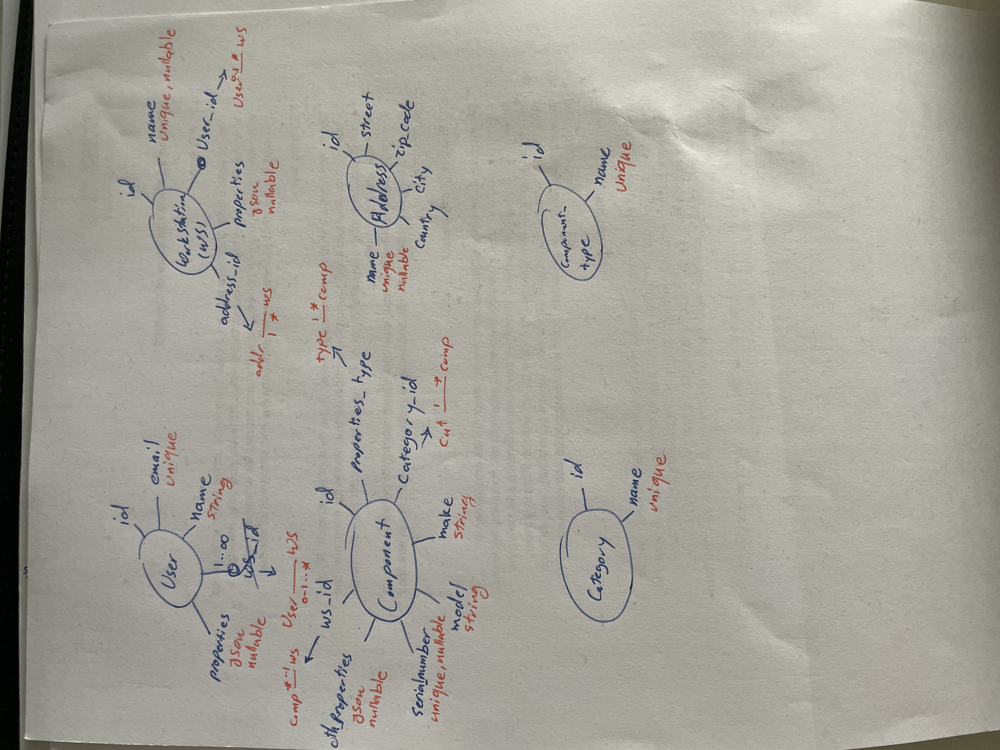

Back to: [Thinking Process](ThinkingProcess.md)

# 3.Ideate

## Pest vs PHPUnit
### [Q] for this project, which one works better?
Pest is better for this project. in small projects, PHPUnit adds a lot of overhead.
Also Pest is growing fast, and nowadays you can see bigger projects using it.

### [Q] for a TDD approach, which one works better?
I prefer to use Pest, because it’s more readable and steps are more explicit.
1. first, I write the testcases like I am writing in a word document.

for instance:

``it('can create user using correct email & password');``

``it('fails user creation on duplicated email');``
2. then, I write the testcases' body.

This approach, makes the thinking process more clear and improves the readability.

### [Q] how can I organize my tests?
Major folder structure is what Laravel provides. Unit and Feature folders.

Inside each folder, I use my Domains as a Folder to better separation which perfectly fits to main project's folder structure.

## Initial Domains
1. User
2. Workstation
3. Component
4. Import Management System

## Initial Database ERD

